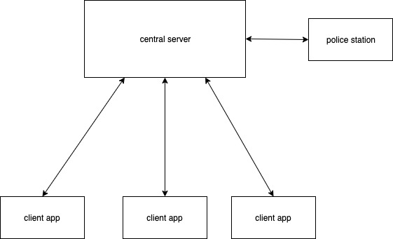
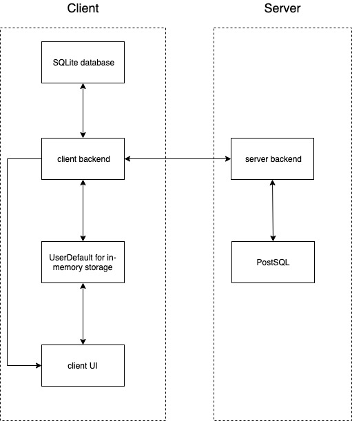
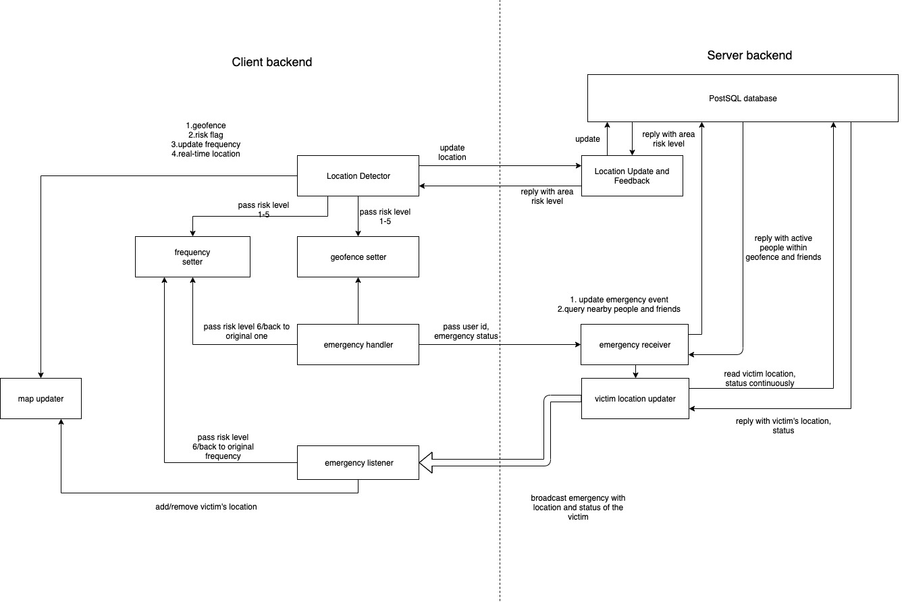

 ### <font color="#3498db">Introduction</font>

This safe guarding app is proposed under the context that last year, several robberies happened in the student accommodation area. It exposed the lack of effective and instant way to call for help when emergency situations occurred. This may lead to severe results including loss of properties, physical harm and even life danger. The basic idea of this app is to alert people who are friends or close to the victims when emergency situations happen so that they can call for help. The final goal of this project will be promoting this app to the leasing for students, and encourage them to install this app on mobile devices of the community security. 

### <font color="#3498db">Requirement</font>

#### Functional Requirements

| Features                              | Description                                                  |
| ------------------------------------- | ------------------------------------------------------------ |
| Sign up/in |The clients are able to sign up an account of which information will be updated to th e server. The server would do verification everytime a client tries to login with his account|
| Detect/update locations               | The client side detects every login users’ real-time location with a default frequency |
| Report locations                      | The client side app reports the real-time locations of users after updating the location |
| Define geofence                       | The client raises a danger flag, once they are planning to go through a dangerous area. This action should be perceived by the server |
| Send alerts                           | The client side would send an emergency signal to the server when specific behaviors are triggered such as pressing a button, shouting out loud, or shaking the device. |
| Rank risk levels on areas             | The server side defines several risk levels based on past crime history. The risk levels will be labeled with different colors and also get updated with new data. |
| Notify clients for highly risked area | The server sends a watch-out signal to a client when the server receives the latest location of the client, and find it a highly risky area |
| Notify clients for nearby crime       | The server sends information of victim to users within the geofence and to people in friend lists |
#### Non-functional Requirements

| Features                                                     | Description                                                  |
| ------------------------------------------------------------ | ------------------------------------------------------------ |
| Modify location update frequency based on the risk level of area the user resides in | The server set lower and upper bounds on update frequency. The frequency update is switched on based on crime history of the current area. |
| Update geofence based on the risk level of area the user resides in | The client side will update the geofence within which other active users and the user’s friends will get notified according to the risk level of the area the user resides in |

#### In the Future

| Features                                                     | Description                                                  |
| ------------------------------------------------------------ | ------------------------------------------------------------ |
| Inform security in the community or police station of the undergoing emergency | The central server would set up a connection to the police station and alert emergency when danger happens |
| Annotate area risk levels on a map                           | The client acquires information of crime area and be more aware of crossing such areas |
| Record the heroes in events when the reinforcement succeeds. | The client could confirm the heroes who do contributions in the rescue |
| Send all users newsletters about the monthly hero in areas   | The server would send a newsletter to all users who subscribe the newsletter service to broadcast monthly hero in areas |
| Triggers the sound recording mode automatically when alert is sent | The client side app would automatically start sound recording when an emergency alert is sent. |

### <font color="#3498db">System Architecture</font>

#### Context



#### Container



#### Component



 ### <font color="#3498db">Usage</font>

Install pods

```bash
$ pod install
$ pod update
```

